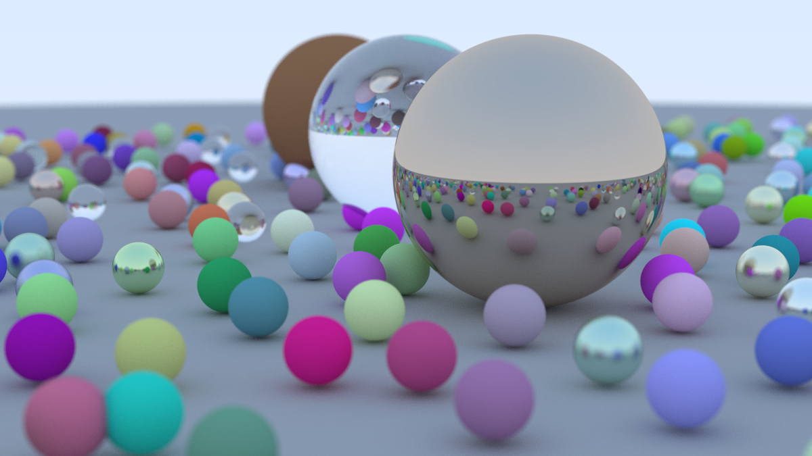

# go-trace-rays

A basic ray tracer written in Go following "[Ray Tracing in One Weekend](https://raytracing.github.io/books/RayTracingInOneWeekend.html#movingcameracodeintoitsownclass)" by Peter Shirley, Trevor David Black, and Steve Hollasch with minor modifications.



## Features
- Simple and extensible architecture
- Support for spheres
- Basic materials (matte, metal, glass)
- Support for camera movement and focus
- Parallelised rendering using goroutines


## Installation

### Pre-requisites
- Go 1.24 or later
- Also make sure your $PATH includes your Go bin directory (usually $HOME/go/bin)
- A .ppm image viewer

```sh
go install github.com/sendelivery/go-trace-rays@latest
go-trace-rays > out.ppm # the rendered image will be written to ./out.ppm
```

## Development

### Pre-requisites
- Go 1.24 or later
- GNU Make

### Make targets
To build the project to `./bin/rt`, run:

```sh
make build
```

To output a rendered image to `./image.ppm`, run one of the following:

```sh
make render # single-threaded workflow
make render-parallel # parallelised workflow
```

For basic debugging, you can use:

```sh
make debug # prints pixel colours to stdout
```

### Testing

Some unit tests are included, they can be run with:

```sh
go test ./...
```
